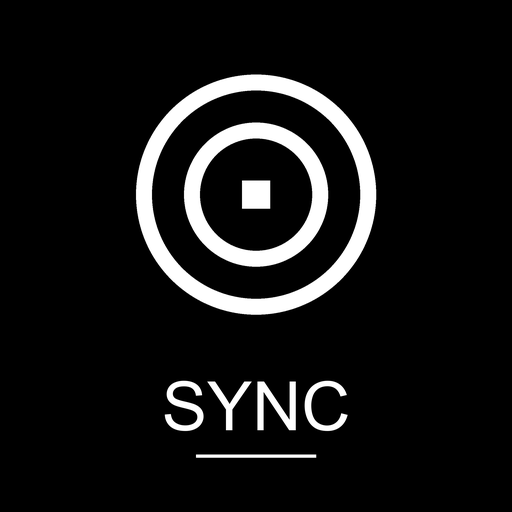
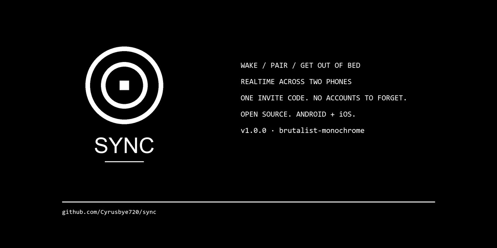

# SYNC

<p align="center">
  
</p>

<p align="center">
  
</p>

**Mornings are brutal enough.** SYNC is an alarm app for two people. You both wake up. From the same alarm. Without cheating.

It is built for two and only two. Once you pair with someone — a six-digit code, no email confirmations, no accounts to forget — you can set alarms for *them* as easily as you set them for yourself. Their phone rings, your message shows up, and you both start moving.

There are no algorithms. There is no "engagement". There is no cloud-rec of your mornings. There is just an alarm.

---

## What it does

- Sign in with **Discord** or **GitHub** — no new account.
- Pair with one person by sending them a six-digit code.
- Set alarms for **you** and **them** separately, with custom wake-up messages.
- Snooze with one tap. Stop requires a long press — because 6am is when accidents happen.
- Reactions on dismiss (❤️ 😴 🔥 ☕) show up in your shared feed.
- A `WAKE THEM` button sends an **in-app nudge via Supabase Realtime** *and* an **FCM HTTP v1 push** so it reaches your partner whether their app is foregrounded, backgrounded, or fully killed.
- Stats card: snooze streak, on-time rate, last wake-up — just for the two of you.

Strictly what you need to wake up.

---

## Stack

| Layer            | Picks                                       |
|------------------|---------------------------------------------|
| Frontend         | Flutter 3.22+, Dart 3                       |
| Backend          | Supabase (Postgres + Realtime + Edge Functions) |
| Auth             | Discord OAuth (primary) · GitHub OAuth      |
| Local alarms     | `alarm` (exact alarms, wake-lock)           |
| Notifications    | `flutter_local_notifications`               |
| State            | `flutter_riverpod`                          |
| Push             | Firebase Cloud Messaging (HTTP v1, service-account auth) |
| UX scaling       | `flutter_screenutil` + `intl`               |
| CI               | GitHub Actions → release APK per push       |

UI is **strictly monochrome**. `#000000` and `#FFFFFF` plus five greys. No accent colours, no shadows, no rounded corners above 4px. Wordmark is `SYNC` in monospace. It is supposed to look like a tool, not an app.

---

## How the WAKE-THEM button reaches your partner

The nudge rides **two rails** so it works in every app-lifecycle state:

1. **Supabase Realtime** (`lib/providers/nudge_provider.dart`). `SupabaseService.insertNudge(targetId)` writes a row into the `nudges` table. Both apps have a Realtime subscription on that table. As long as either app is foregrounded, the recipient sees the Incoming Nudge screen within a heartbeat of the tap. This is the source of truth.

2. **Firebase Cloud Messaging HTTP v1** (`supabase/functions/nudge/index.ts`). After the Realtime insert, `SupabaseService.sendNudgePush(targetId)` invokes the `nudge` Edge Function. The function looks up the recipient's `profiles.fcm_token`, mints an OAuth2 access token from a service-account JSON, and POSTs to `https://fcm.googleapis.com/v1/projects/<PROJECT_ID>/messages:send`. The OS displays a high-priority notification even if the recipient's app is killed. Tapping the notification launches the app and the Realtime subscription picks up from there.

The Edge Function also inserts a duplicate row into `nudges` so the FCM path is idempotent with the Realtime path — there is exactly one nudge record per `WAKE THEM` tap.

---

## Setup

### 1. Supabase

1. Create a project at [supabase.com](https://supabase.com).
2. Open the SQL Editor and run [`supabase/init.sql`](supabase/init.sql). It creates the tables (`profiles`, `pairings`, `alarms`, `alarm_logs`, `nudges`), RLS policies, two pairing RPCs, the profile-on-signup trigger, and the Realtime publication. `profiles` includes a `fcm_token` column.
3. Authentication → Providers → enable **Discord** and **GitHub**, drop in your OAuth credentials.
4. Authentication → URL Configuration → Site URL: `io.supabase.syncalarm://login-callback/`.
5. Deploy the Edge Function:
   ```bash
   supabase functions deploy nudge --project-ref <ref>
   ```

### 2. Firebase Cloud Messaging (HTTP v1)

1. Create a Firebase project at [console.firebase.google.com](https://console.firebase.google.com). The Android package name **must** be `com.sync.alarm` (matches `applicationId` in `android/app/build.gradle`).
2. Project Settings → **Your apps** → Add Android app → enter `com.sync.alarm` → Download `google-services.json`. Drop the file at `android/app/google-services.json`. Without it, the `apply plugin: 'com.google.gms.google-services'` line in `android/app/build.gradle` is skipped and the build still succeeds, but FCM will not function at runtime.
3. Project Settings → **Cloud Messaging** → ensure **Cloud Messaging API (Legacy, HTTP)** is **disabled** (it is not used in v1). The HTTP v1 API is the only path used.
4. Project Settings → **Service Accounts** → click **Generate new private key**. A JSON file downloads.
5. Read off `client_email`, `private_key`, `project_id`, and `token_uri` from the JSON and set them as Supabase Edge Function secrets:
   ```bash
   supabase secrets set \
     FCM_PROJECT_ID=<project_id from the JSON> \
     FCM_SERVICE_ACCOUNT_JSON="$(cat path/to/service-account.json)"
   ```
   (One-line set with the full JSON contents, not the file path.) The Edge Function reads `FCM_PROJECT_ID` and `FCM_SERVICE_ACCOUNT_JSON` at invocation time and mints a fresh OAuth2 access token using the Web Crypto API — no `google-auth-library` vendoring needed.

### 3. OAuth

- **Discord**: Developer Portal → New App → OAuth2 → Redirect: `https://<ref>.supabase.co/auth/v1/callback`.
- **GitHub**: Settings → Developer settings → New OAuth App → same callback URL.

### 4. Configuration

The app never contains a Supabase project URL or key in source control. Pass
the values at build time instead:

```bash
flutter run \
  --dart-define=SUPABASE_URL="$SUPABASE_URL" \
  --dart-define=SUPABASE_ANON_KEY="$SUPABASE_ANON_KEY"
```

For GitHub releases, set `SUPABASE_URL` and `SUPABASE_ANON_KEY` as repository
Actions secrets. The workflow refuses to build an APK if either secret is
missing. The public/anon key will still be present in the compiled APK, as it
must be for a mobile client to connect; protect all data with Supabase RLS.

### 5. Build

```bash
flutter pub get
flutter run                        # dev
flutter build apk --release \
  --dart-define=SUPABASE_URL="$SUPABASE_URL" \
  --dart-define=SUPABASE_ANON_KEY="$SUPABASE_ANON_KEY" # ship
```

---

## CI / Release

Every push to `main` triggers `.github/workflows/build-apk.yml`. Set the
`SUPABASE_URL` and `SUPABASE_ANON_KEY` Actions secrets once in the repository
settings; the workflow injects them into the release build and fails if either
is absent. It then runs `flutter analyze`, builds the APK, and uploads it as
an artifact named `release-apk`. The build is signed with the debug keystore
as a stop-gap — rotate before publishing to the Play Store.

> **Tip for CI:** if you want the GitHub Actions build to ship an APK with FCM wired in, add `google-services.json` as a repository secret (`GOOGLE_SERVICES_JSON_BASE64`) and prepend a decode step at the top of the workflow:
> ```yaml
> - name: Decode google-services.json
>   run: echo "${{ secrets.GOOGLE_SERVICES_JSON_BASE64 }}" | base64 -d > android/app/google-services.json
> ```

Releases are tagged by hand (`v1.0.0`, `v1.1.0`, …). To publish one after CI passes:

```bash
gh release create v1.0.0 \
  build/app/outputs/flutter-apk/app-release.apk \
  --title "v1.0.0 — first wake" \
  --notes-file - <<'EOF'
- First public build.
- Discord + GitHub auth.
- Pair with one person. One alarm. No fluff.
- FCM HTTP v1 + Realtime dual-rail nudge delivery.
EOF
```

---

## Project layout

```
lib/
├── main.dart                       # entry, alarm boot, deep-link route
├── supabase_config.dart            # env loader with baked-in defaults
├── models/                         # alarm, profile, pairing, alarm_log, nudge
├── providers/                      # Riverpod: auth, alarm, pairing, connectivity, nudge
├── services/                       # Supabase, AlarmService, Battery, FcmService
├── screens/                        # splash, login, pair, home, ring, form, reactions, incoming_nudge
├── widgets/                        # monochrome_button, alarm_card, day_selector, …
└── theme/                          # the only palette you may use
supabase/
├── init.sql                        # schema, RLS, RPCs, Realtime
└── functions/nudge/index.ts        # FCM HTTP v1 nudge writer
android/                            # AndroidX, deep-link, exact-alarm perms, FCM default channel
.github/workflows/
└── build-apk.yml                   # release APK per push to main
```

---

## Permissions (Android 12+)

The app asks for `SCHEDULE_EXACT_ALARM` on first launch. If the user denied it, they're sent to system settings with a one-tap path. Without exact alarms, this app is useless — so we surface the permission clearly.

Doze mode: a one-time onboarding dialog explains how to disable battery optimization for SYNC.

iOS: schedules a critical local notification at alarm time as a fallback (Apple does not allow true background alarm ringing).

---

## Privacy

`profiles` stores: username, avatar URL, timezone, sleep status (`awake`/`asleep`), battery percent, **FCM device token** (so the partner can push to you). Nothing else.

`alarm_logs` stores: firing, snoozes, dismisses, and reactions — visible to both members of the pair only.

`nudges` stores: who nudged whom and when. Used in-app only; auto-pruned after read.

No analytics. No third-party trackers. No Crashlytics, no Google Analytics SDK. The only data we have is the data you typed in.

---

## License

MIT. Build it, fork it, ship it.
