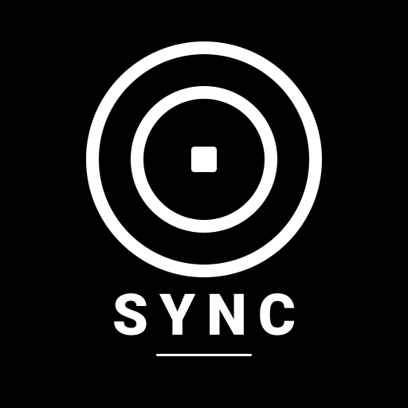
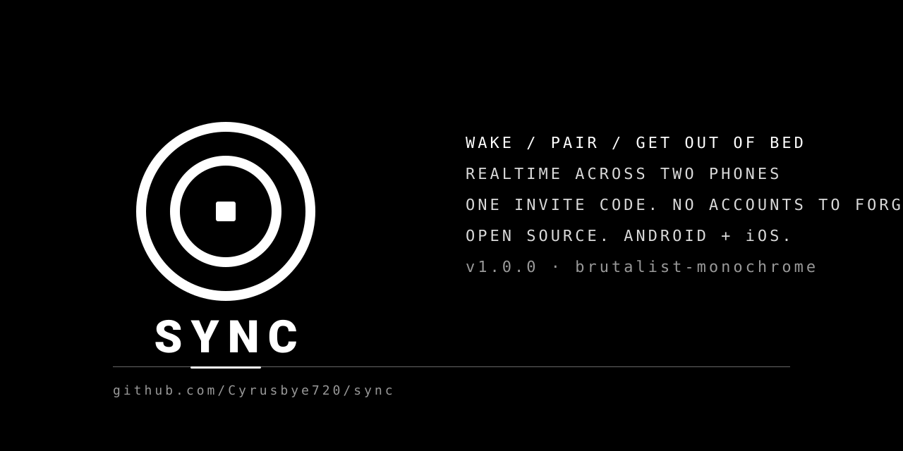

# SYNC

<p align="center">
  
</p>

<p align="center">
  
</p>

**Mornings are brutal enough.** SYNC is an alarm app for two people. You both wake up. From the same alarm. Without cheating.

It is built for two and only two. Once you pair with someone — a six-digit code, no email confirmations, no accounts to forget — you can set alarms for *them* as easily as you set them for yourself. Their phone rings, your message shows up, and you both start moving.

There are no algorithms. There is no ‘engagement’. There is no cloud-rec of your mornings. There is just an alarm.

---

## What it does

- Sign in with **Discord** or **GitHub** — no new account.
- Pair with one person by sending them a six-digit code.
- Set alarms for **you** and **them** separately, with custom wake-up messages.
- Snooze with one tap. Stop requires a long press — because 6am is when accidents happen.
- Reactions on dismiss (❤️ 😴 🔥 ☕) show up in your shared feed.
- A `WAKE THEM` button sends a high-priority nudge via push.
- Stats card: snooze streak, on-time rate, last wake-up — just for the two of you.

Strictly what you need to wake up.

---

## Stack

| Layer            | Picks                                       |
|------------------|---------------------------------------------|
| Frontend         | Flutter 3.22+, Dart 3                       |
| Backend          | Supabase (Postgres + Realtime + Edge Functions) |
| Auth             | Discord OAuth (primary) · GitHub OAuth     |
| Local alarms     | `alarm` (exact alarms, wake-lock)           |
| Notifications    | `flutter_local_notifications`               |
| Push             | `firebase_messaging`                        |
| State            | `flutter_riverpod`                          |
| UX scaling       | `flutter_screenutil` + `intl`               |
| CI               | GitHub Actions → release APK per push       |

UI is **strictly monochrome**. `#000000` and `#FFFFFF` plus five greys. No accent colours, no shadows, no rounded corners above 4px. Wordmark is `SYNC` in monospace. It is supposed to look like a tool, not an app.

---

## Setup

### 1. Supabase

1. Create a project at [supabase.com](https://supabase.com).
2. Open the SQL Editor and run [`supabase/init.sql`](supabase/init.sql). It creates the tables, RLS policies, two pairing RPCs, the profile-on-signup trigger, and the Realtime publication.
3. Authentication → Providers → enable **Discord** and **GitHub**, drop in your OAuth credentials.
4. Authentication → URL Configuration → Site URL: `io.supabase.syncalarm://login-callback/`.
5. Database → Replication → enable Realtime on `alarms`, `pairings`, `profiles`, `alarm_logs` (the SQL already does this).
6. Edge Functions: `supabase functions deploy nudge --project-ref <ref>`. Set the secret: `supabase secrets set FCM_SERVER_KEY=…` (legacy FCM key).

### 2. OAuth

- **Discord**: Developer Portal → New App → OAuth2 → Redirect: `https://<ref>.supabase.co/auth/v1/callback`.
- **GitHub**: Settings → Developer settings → New OAuth App → same callback URL.

### 3. Firebase (push)

1. Project → Add app → Android, package `com.sync.alarm`.
2. Download `google-services.json` → drop into `android/app/`.
3. (Optional) iOS: download `GoogleService-Info.plist` → drop into `ios/Runner/`.

### 4. Local environment

```
cp .env.example .env
```

Fill in:

```
SUPABASE_URL=https://<ref>.supabase.co
SUPABASE_ANON_KEY=<anon-public-key>
```

### 5. Build

```bash
flutter pub get
flutter run                        # dev
flutter build apk --release        # ship
```

---

## CI / Release

Every push to `main` triggers `.github/workflows/build-apk.yml`. The workflow builds the release APK and uploads it as an artifact named `release-apk`.

Releases are tagged by hand (`v1.0.0`, `v1.1.0`, …). To publish one after CI passes:

```bash
gh release create v1.0.0 \
  build/app/outputs/flutter-apk/app-release.apk \
  --title "v1.0.0 — first wake" \
  --notes-file - <<'EOF'
- First public build.
- Discord + GitHub auth.
- Pair with one person. One alarm. No fluff.
EOF
```

---

## Project layout

```
lib/
├── main.dart                  # entry, FCM boot, deep-link route
├── supabase_config.dart       # env loader
├── models/                    # alarm, profile, pairing, alarm_log
├── providers/                 # Riverpod: auth, alarm, pairing, connectivity
├── services/                  # Supabase, AlarmService, FCM, Battery
├── screens/                   # splash, login, pair, home, ring, form, reactions
├── widgets/                   # monochrome_button, alarm_card, day_selector, …
└── theme/                     # the only palette you may use
supabase/
├── init.sql                   # schema, RLS, RPCs
└── functions/nudge/index.ts   # FCM-pushes a "nudge" to your partner
android/                       # AndroidX, deep-link, exact-alarm perms
.github/workflows/
└── build-apk.yml              # release APK per push to main
```

---

## Permissions (Android 12+)

The app asks for `SCHEDULE_EXACT_ALARM` on first launch. If the user denied it, they’re sent to system settings with a one-tap path. Without exact alarms, this app is useless — so we surface the permission clearly.

Doze mode: a one-time onboarding dialog explains how to disable battery optimization for SYNC.

iOS: schedules a critical local notification at alarm time as a fallback (Apple does not allow true background alarm ringing).

---

## Privacy

`profiles` stores: username, avatar URL, FCM token (push only), timezone, sleep status (`awake`/`asleep`), battery percent.

`alarm_logs` stores: firing, snoozes, dismisses, and reactions — visible to both members of the pair only. No analytics. No third-party trackers. The only data we have is the data you typed in.

---

## License

MIT. Build it, fork it, ship it.
